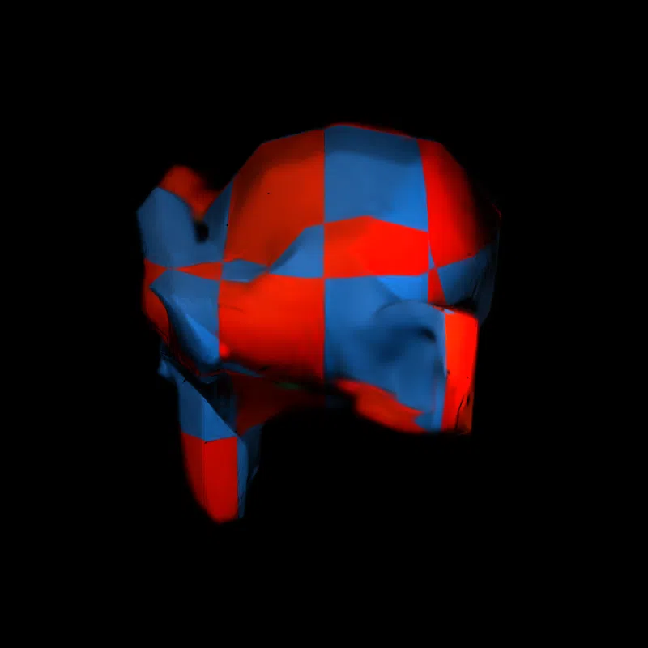
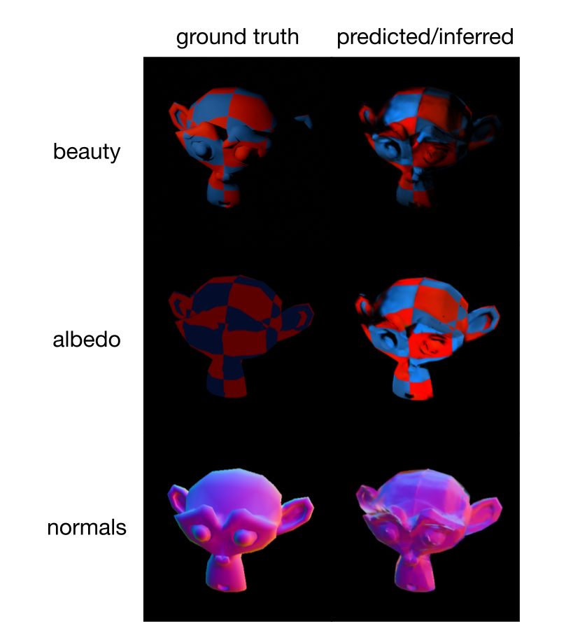

# Relightable 3D Gaussian Splatting

In this project, I modified a 3D Gaussian splatting pipeline to infer albedo and surface normals, thus allowing for rendering views under novel lighting conditions by applying a Lambertian reflectance model. I also created a custom dataset (checkered_suzanne) consisting of 400 training images and 30 test images, which I used to test and validate pipeline. You can read more about this project on [my website](https://matthewlam.me/relightable_3dgs/).

Below is a pretty animation showing novel views under novel light source positions!

## Repository structure

- [`train.py`](train.py): script containing training loop, as well as data loading, shading, optimization and checkpointing
- [`render_compare.py`](render_compare.py): script that makes side-by-side comparisons of inferred renders versus ground truths for beauty, normals and albedo
- [`render_video.py`](render_video.py): script that makes an animation/video demonstrating what renders look like with different views and light positions 
- [`run_project_in_colab.ipynb`](run_project_in_colab.ipynb): notebook that is used to run essentially the whole project
- [`requirements.txt`](requirements.txt)
- [`suzanne.blend`](suzanne.blend): Blender file used to generate the checkered_suzanne dataset

## About the *checkered_suzanne* Dataset
I created a custom dataset (which I call *checkered_suzanne*) for this project using Blender. Here is the [Google Drive link](https://drive.google.com/file/d/1PFs0D2AOdhcZ-qM9OGh8_mko_RXkTnm3/view?usp=sharing) to the dataset. I created it using Suzanne, a 3D model of a chimpanzee head, which is provided in Blender. My dataset contains 400 training images, as well as 30 test images. The training set contains images of the model captured with 4 distinct light positions. The test set contains images captured with yet another distinct light position.

## Setup and Usage

**Step 1. Download the Dataset:** Dowload the `checkered_suzanne.zip` dataset from the Google Drive link [here](https://drive.google.com/file/d/1PFs0D2AOdhcZ-qM9OGh8_mko_RXkTnm3/view?usp=sharing). Then upload the .zip file to your own Google Drive.

**Step 2. Run the project in Google Colab:**
Open [`run_project_in_colab.ipynb`](run_project_in_colab.ipynb) in Colab and follow the instructions provided in the notebook. The notebook mounts Drive, clones the repo, installs dependencies, copies the dataset locally, and runs [`train.py`](train.py), [`render_compare.py`](render_compare.py) and [`render_video.py`](render_video.py). 

## Results
I trained a Gaussian model on the checkered_suzanne dataset and obtained the following results.

**Side-by-side comparisons**

Below are comparisons between the ground truths and predicted/inferred images/properties for views in the test set (under a novel light position). The first row is the beauty render (the actual final rendered image). The second and third rows are color maps of albedo and normals respectively.

**Test metrics**

The following table shows metrics indicating the accuracy of the reconstruction, calculated as average values on the test set.

| Metric | Value |
|---|---|
| Avg beauty PSNR (full frame) | 32.53 dB |
| Avg albedo L1 error (background masked) | 0.6821 |
| Avg normal angular error (background masked) | 21.74 deg |

## Acknowledgments

This project uses `gsplat.rasterization` and `gsplat.strategy.DefaultStrategy` from [gsplat](https://github.com/nerfstudio-project/gsplat) (from the Nerfstudio team), used as an unmodified dependency.

## License

This project is licensed under the [MIT License](LICENSE).